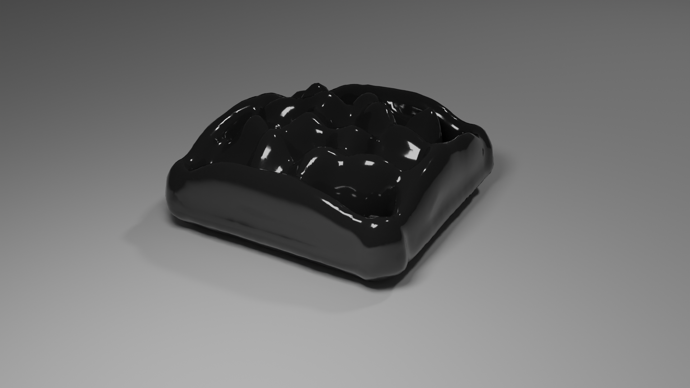

# Accurate-Large-Scale-Ferrofluids


An implementation of "On the Accurate Large-scale Simulation of Ferrofluids"

<em>Disclaimer: This repo is the final project for CSC417 Physics Basd Animation provided by University of Toronto and the results do not reflect the result of the actual paper. This implemention may contain mistakes so please read it at your discretion</em>

## Build & Run
We have tested on Ubuntu 20.04 with gcc9.3 and Windows 10 with Visual Studio 2019
```
git clone --recursive https://github.com/shiinamiyuki/Accurate-Large-Scale-Ferrofluids
mkdir build && cd bulid
cmake .. -DCMAKE_BUILT_TYPE=Release
make -j 8
./sim
```

see `src/main.cpp` for more scene setups<br />

we have also prepared fluid simulation scenes for non magnetic fluid.<br />

## Future Improvement
This repository contains implementation of algorithm proposed in paper "On the Accurate Large-scale Simulation of Ferrofluids". We have successfully calculated the magnetic force acted on each particle position of ferrofluid when placed under a fixed magnetic field. We can clearly see the spikes formed by the particles of the ferrofluid. Due to limited amount of particles the result does not completely resemble the original result in the paper. Also surface reconstruction can still be improved.<br />
Due to limited computation resources, it is hard for us to simulate the large scale scene such as pouring ferrorfluid on Helix-shaped and bunny-shaped magnet or even just ferrofluid with higher amount of particles (The paper used 98k particles while we used 4k).<br />
The paper also employed the fmm library which we did not use. This library should help with the overall performance of the algrithm.<br />
